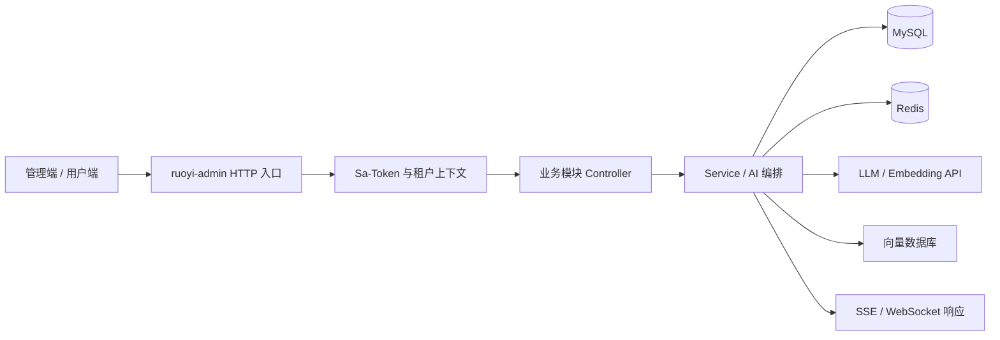

# 项目概览

RuoYi AI 是基于 RuoYi-Vue-Plus 体系构建的企业级 AI 后端。它把传统的用户、角色、租户、权限和工作流能力，与模型管理、流式对话、RAG、MCP 工具和多智能体编排整合在一个 Spring Boot 应用中。

## 核心能力

| 领域 | 当前实现 |
| --- | --- |
| 模型接入 | OpenAI、DeepSeek、通义、智谱、MiniMax、Ollama 等 Provider |
| 对话 | 会话与消息管理、SSE 流式输出、多模态与图片生成 |
| 知识库 | 文档解析、切片、向量化、检索、重排和知识图谱 |
| 向量存储 | Milvus、Weaviate、Qdrant |
| 工具生态 | MCP 市场、MCP 工具、LangChain4j Skills |
| AI 编排 | 节点与边模型、运行时状态、LangGraph4j 工作流 |
| 业务流程 | Warm-Flow 定义、任务、实例、审批和抄送 |
| 平台基础 | Sa-Token、JWT、多租户、数据权限、Redis、OSS、监控 |

## 技术基线

- Java 17
- Spring Boot 3.5.8
- Maven 多模块工程
- LangChain4j 1.13.0、LangGraph4j 1.5.3
- MyBatis-Plus 3.5.14、MySQL 8
- Redis / Redisson
- Sa-Token 1.44.0
- Undertow、Springdoc / Knife4j

## 一次典型请求

应用由 `ruoyi-admin` 统一装配并启动；`ruoyi-modules` 提供领域功能；`ruoyi-common` 提供可复用基础设施；`ruoyi-extend` 包含可独立运行的监控和任务调度服务。
