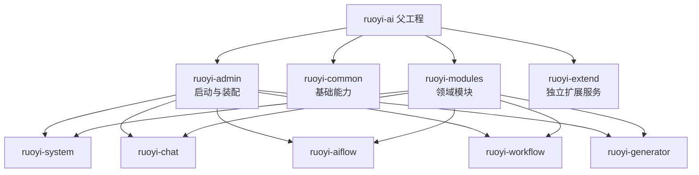
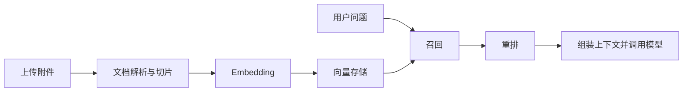

# 系统架构

## Maven 聚合结构



## 应用分层

领域模块大体遵循以下分层：

```text
controller -> service -> mapper -> database
                 |
                 +-> model/vector/MCP/external platform
```

- `controller`：HTTP 入参、权限注解、响应包装。
- `service`：业务规则、事务边界、AI 或工作流编排。
- `mapper`：MyBatis-Plus 数据访问，XML 位于 `src/main/resources/mapper`。
- `domain`：实体、BO、VO、DTO 等数据模型。
- `common`：认证、租户、数据权限、日志、Redis、Web/SSE 等横切能力。

## 对话链路

`POST /chat/send` 进入 `ChatController`，再交由公共聊天接口和具体 Provider 实现处理。模型实现集中在：

```text
ruoyi-modules/ruoyi-chat/src/main/java/org/ruoyi/service/chat/impl/provider
```

会话与消息持久化、SSE 输出、模型调用和工具调用在此链路汇合。新增模型时应复用现有抽象，而不是在 Controller 中直接创建 SDK 客户端。

## RAG 链路



对应实现主要位于 `service/knowledge`、`service/embed`、`service/vector`、`service/retrieval` 和 `service/rerank`。

## 两类工作流

- `ruoyi-aiflow`：面向 AI 节点、组件和运行时的编排能力。
- `ruoyi-workflow`：基于 Warm-Flow 的传统审批/业务流程。

两者包名部分重合，阅读或新增代码时需根据 Maven 模块路径区分，避免误把审批流程逻辑放进 AI 编排模块。
